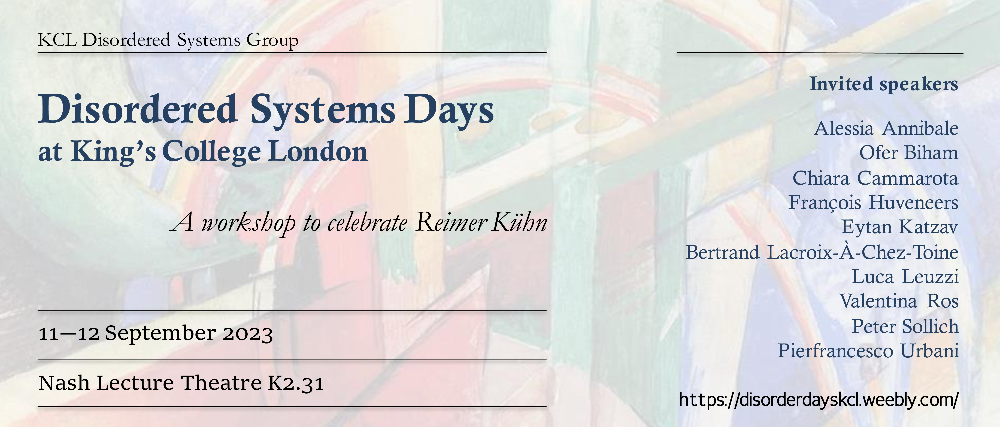

The Disordered Systems group organised a [two-day event](https://disorderdayskcl.weebly.com/) on the physics of disorder in both the classical and quantum setting, hosting a selection of international leading experts in the field. The first day of the event has been dedicated to our dear colleague **Reimer Kühn**, who retired in 2023. The Workshop has been an opportunity to thank Reimer for his invaluable contributions to the field and to the life of our research group.

You can find the program of the event, with some material, below.

***

## Monday September 11th, 2023

**Peter Sollich**\.  (University of Göttingen)\
[Glassy random walks: large deviations and aging.](./SOLLICH.pdf)

**Eytan Katzav**\.  (University of Jerusalem)\
[The distribution of shortest path lengths in random networks.](./katav.pdf)

 <a class="btn btn-primary btn-sm" href="https://www.youtube.com/watch?v=pNq4qg0YBtA" role="button"> <i class="fab fa-youtube"></i> </a> **Ofer Biham**\.  (University of Jerusalem)\
[The giant component, articulation points and bredges in configuration model networks.](./biham.pdf)

**Alessia Annibale**\.  (King's College London)\
[Mathematicians against gene-regulatory networks.](./annibale.pdf)

**Pierfrancesco Urbani**\.  (Université Paris-Saclay, CNRS, CEA, IPhT)\
The KHGPS model and the spin glass transition in a field.

## Tuesday September 12th, 2023

**Luca Leuzzi**\.  (Institute of Nanotechnology — CNR-NANOTEC)\
[Random lasers as complex disordered systems: a spin-glass-like theory for amplified mode-locking waves in random media.](./leuzzi.pdf)

**François Huveneers**\.  (King's College London)\
[Spreading of a wave packet in a disordered anharmonic chain.](./huveneers.pdf)

**Valentina Ros**\.  (LPTMS Paris-Saclay)\
[Counting equilibria in high-D random systems: from Gaussian landscapes to simple ecosystems.](./ROS.pdf)

**Chiara Cammarota**\.  (Sapienza Università di Roma)\
[Glass dynamics and Signal reconstruction in rough landscapes..](./cammarota.pdf)

**Bertrand Lacroix-À-Chez-Toine**\.  (King's College London)\
[Fluctuations of the ground-state energy of spherical spin-glasses.](./lact.pdf)

