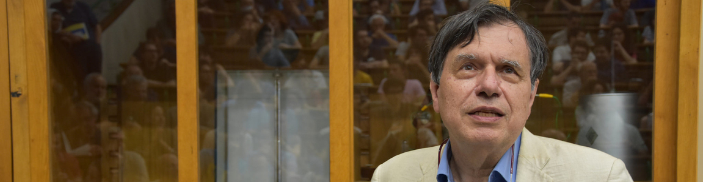
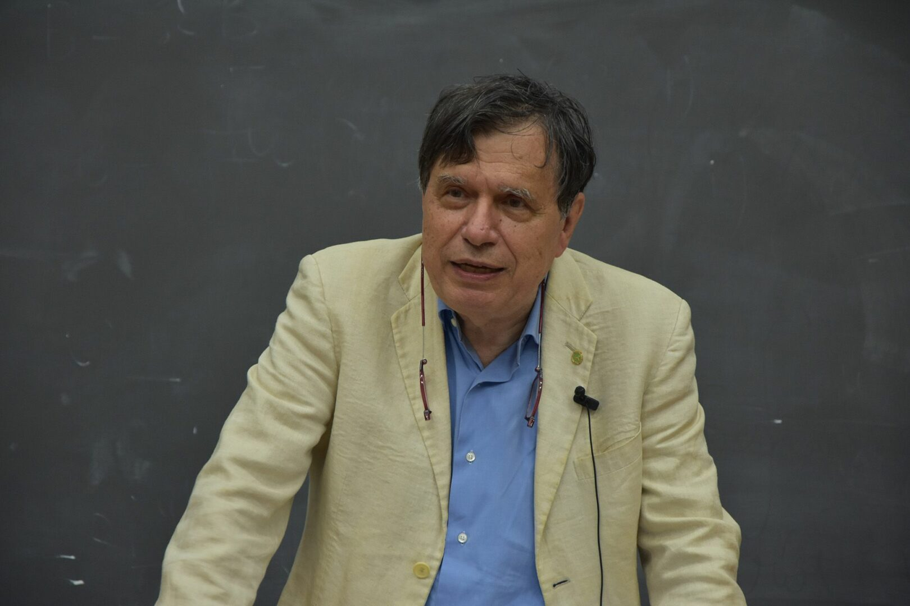

Giorgio Parisi made several groundbreaking contributions to the Physics of Complex Systems. These are systems consisting of many interacting particles, and frequently, in the real world, this interaction is essentially random. He has provided deep insights, both physical and mathematical, into several paradigmatic models which serve as benchmarks in the field. These models, sometimes developed to understand very concrete physical systems, help to elucidate generic (or as physicists frequently call them, ''universal'') properties, common to a very broad class of phenomena which look remote from the original model.

One of the models, now known as the Kardar-Parisi-Zhang (KPZ) model, addressed patterns which arise when some material is randomly deposited onto a surface (imagine snowfall on the floor), and in this way the height of the surface grows. It is intuitively clear that the resulting surface becomes rough over time, but to characterize the surface roughness in a precise quantitative way via a tractable mathematical formalism is a very challenging problem. The KPZ model, proposed in 1985, allows such a characterization, possesses beautiful mathematical properties which have been fully understood and utilized only in the last decade, and remains a very active field of research both in Physics and Mathematics.

Another beautiful discovery by Parisi (this time without collaborators) stemmed from solving the paradigmatic model of random magnetic materials. To begin with, one may think of standard magnetic substances like iron or steel as a collection of a huge number of elementary ''atomic magnets'', known as ''spins''. These can be usefully visualized as tiny arrows, and each taken alone may point in any direction. In standard magnets neighbouring atoms have a tendency to alligning their arrows along the same direction (one may say they ''like to look in the same direction''), and as the result of such interaction all arrows in the substance will eventually look in the same direction. Such pattern of arrows is obviously highly ordered - one can think of it as a ''magnetic crystal''. However, there exist substances where some pairs of atoms may have a tendency for their ''arrows'' to look in the same direction, whereas other pairs of atoms may prefer to have their ''arrows'' looking in exactly opposite directions. If the number of ''alligning'' and ''anti-alligning'' pairs are roughly the same the whole pattern of arrows will look at first glance highly irregular, seemingly without order. Such substances are called ''spin glasses'' (akin to atoms in usual glasses being not ordered, but randomly positioned in space). A surprising and completely unexpected discovery by Parisi in 1979 was that actually such substances do have an unusual, well hidden order in the pattern of their ''spin arrows''. But this order can not be seen by the naked eye, and can be revealed only by exploiting equally unusual mathematical machinery. To give a flavour of the striking features behind the ''Parisi solution'' one may mention that it required to consider geometry in ''zero spatial dimension''! Recall that we live in three-dimensional world; structures in the plane are called two-dimensional, and on a single line one-dimensional. One might think of zero-dimensional object as a single point, and this naively has no structure. Parisi ingeniously suggested that in a certain sense such objects may have a rich hierarchic structure - which in the end helps to describe hidden order in ''spin glasses''. And this is not at all an academic oddity - by now ''zero dimensional'' hierarchic patterns discovered by Giorgio Parisi turned out to be relevant in many fields in Physics - ranging from Quantum Gravity to Machine Learning, and eventually in pure mathematical works aiming to understand patterns behind the main building blocks of Arithmetics - the prime numbers.

Parisi's contributions are among the most important to the theory of complex systems, not only in physics but also in other areas such as mathematics, biology, neuroscience, to mention a few. His work gives an example of the power of interdisciplinary research to tackle, understand and solve challenging problems. An example to follow. Thanks Giorgio!
