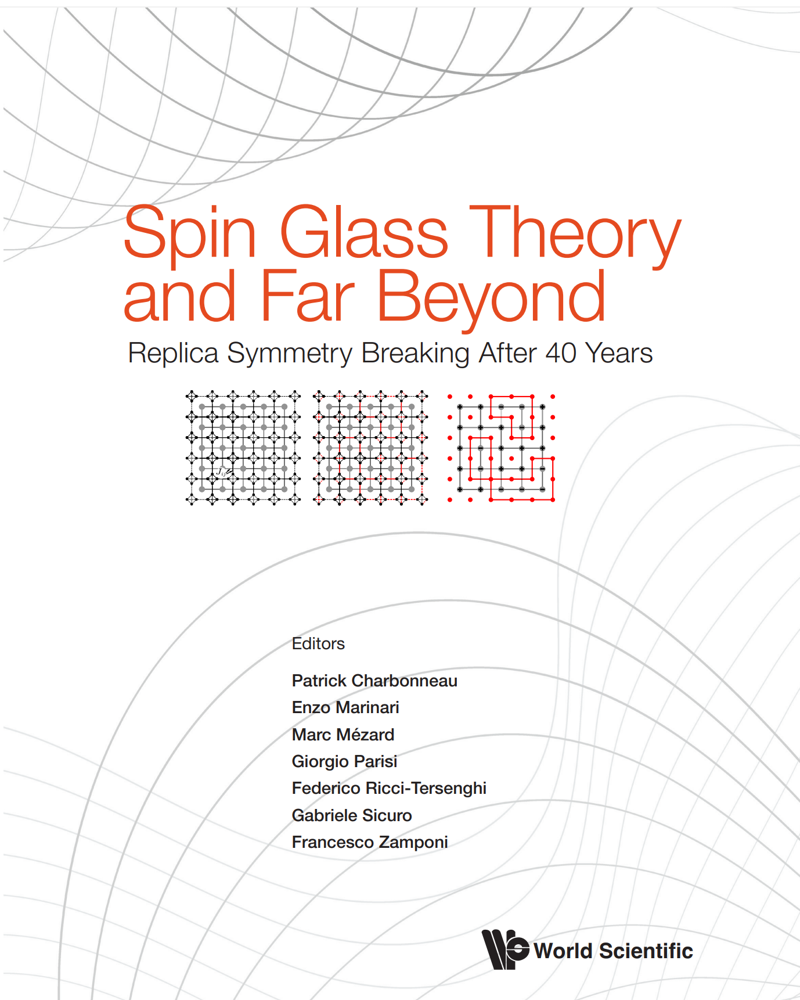

The far-reaching implications of the theory of spin glasses were highlighted further by the 2021 Nobel Prize in Physics, of which half was awarded to Giorgio Parisi for "the discovery of the interplay of disorder and fluctuations in physical systems from atomic to planetary scales." Since the first observation in the 1960s, the theory of spin glasses has unexpectedly found applications in a wide array of scientific problems. This ranges from amorphous solids to movements of birds as they fly in a flock.

In [**Spin Glass Theory and Far Beyond**](https://www.worldscientific.com/worldscibooks/10.1142/13341#t=aboutBook), more than 30 contributions are compiled from more than 100 leading
researchers who contributed to these applications over the last few decades. This volume provides a detailed introduction and review of spin glass research. While the fundamentals are expounded, cutting-edge and state-ofthe-art applications are also featured in this encyclopedic overview for enthusiastic readers in the 21st century

The volume is edited by Patrick Charbonneau, Enzo Marinari, Marc Mézard, Giorgio Parisi, Federico Ricci-Tersenghi, Gabriele Sicuro, and Francesco Zamponi.

## Table of contents
1. *Sergio Caracciolo, Alexander K. Hartmann, Scott Kirkpatrick, Martin Weigel*\
  [**Simulated Annealing, Optimization, Searching for Ground States**](https://arxiv.org/abs/2301.00683)
1. *David Sherrington, Jairo R.L. de Almeida*\
   **Beyond the Ising Spin Glass I: $m$-vector, Potts, $p$-spin, spherical, induced moment, random graphs**
1. *Michael K. Kosterlitz*\
   **Beyond the Ising Spin Glass II: Spin glass without replicas**
1. **Renormalization Group in Spin Glasses**
   1. *Tom Lubenski*\
      Mean-Field and $\epsilon$-Expansion for Spin Glasses
   1. *Tamás Temesvári, Imre Kondor*\
      Field theory for the de Almeida-Thouless transition
   1. *Maria Chiara Angelini*\
      [Real-space renormalization group for spin glasses](https://arxiv.org/abs/2302.05292)
1. *Victor Martin-Mayor, Juan J. Ruiz-Lorenzo, Beatriz Seoane, A. Peter Young*\
   [**Numerical Simulations and Replica Symmetry Breaking**](https://arxiv.org/abs/2205.14089)
1. *Valentina Ros, Yan V. Fyodorov*\
   [**The High-Dimensional Landscapes Paradigm: Spin-Glasses, and Beyond**](https://arxiv.org/abs/2209.07975)
1. *Theodore R. Kirkpatrick, Dave Thirumalai*\
   [**Universal Aspects of the Structural Glass Transition from Density Functional Theory**](https://arxiv.org/abs/1401.2024)
1. **Non-Perturbative Processes in Glasses**
   1. *Peter Wolynes*\
      [The Random First Order Transition Theory of Glasses in Real Space-Time: Instantons, Strings, Flames and Flows](https://arxiv.org/abs/2206.00600)
   1. *Tommaso Rizzo*\
      [Stochastic equations and dynamics beyond mean-field theory](https://arxiv.org/abs/2209.09689)
1. **Dynamical Mean-Field Theory and the Aging Dynamics**
   1. *Andrea Crisanti*\
      Equilibrium dynamics and Replica Symmetry Breaking in spin-glass systems
   1. *Silvio Franz, Jorge Kurchan*\
      [The relation between Parisi scheme and multi-thermalized dynamics in finite dimensions](https://arxiv.org/abs/2207.05720)
   1. *Andrea Maiorano*\
      Weak ergodicity breaking in mean-field spin glasses
1. *Giulio Biroli, Kunimasa Miyazaki, David R. Reichman*\
   [**Dynamical Heterogeneity in Glass-Forming Liquids**](https://arxiv.org/abs/2209.02825)
1. *Chiara Cammarota, Misaki Ozawa, Gilles Tarjus*\
   [**The Kauzmann Transition to an Ideal Glass Phase**](https://arxiv.org/abs/2209.11049)
1. **The Gardner Glass**
   1. *Pierfrancesco Urbani*\
      [Low temperature amorphous solids: mean field theory and beyond](https://arxiv.org/abs/2212.11557)
   1. *Yuliang Jin, Hajime Yoshino*\
      [Computer simulations of the Gardner transition in structural glasses](https://arxiv.org/abs/2206.07868)
1. *Francesco Arceri, Eric I. Corwin, Corey S. O'Hern*\
   [**The Jamming Transition and the Marginally Stable Solid**](https://arxiv.org/abs/2209.02829)
1. **From Polymers to the KPZ Equation**
   1. *Victor Dotsenko, Pierre Le Doussal*\
      Directed polymers and the Kardar-Parisi-Zhang equation
   1. *Henri Orland*\
      Heteropolymers and Proteins
1. **Emergent Dynamics in Glasses and Disordered Systems: Correlations and Avalanches**
   1. *Annette Zippelius, Matthias Fuchs*\
      [From viscous fluids to elastic solids: A perspective on the glass transition](https://arxiv.org/abs/2205.00890)
   1. *Alberto Rosso, James P. Sethna, and Matthieu Wyart*\
      [Avalanches and deformation in glasses and disordered systems](https://arxiv.org/abs/2208.04090)
1. *Claudio Conti, Neda Ghofraniha, Luca Leuzzi, Giancarlo Ruocco*\
   [**Replica Symmetry Breaking in Random Lasers: Experimental Measurement of the Overlap Distribution**](https://arxiv.org/abs/2209.03781)
1. *Saverio Pascazio, Antonello Scardicchio, Marco Tarzia*\
   **Anderson Localization on the Bethe Lattice**
1. *Leticia Cugliandolo, Markus Müller*\
   [**Quantum Glasses ­— A review**](https://arxiv.org/abs/2208.05417)
1. *Alfredo Braunstein, Guilhem Semerjian*\
   [**The Cavity Method: From Exact Solutions to Algorithms**](https://arxiv.org/abs/2209.11499)
1. *Florent Krzakala, Manfred Opper, David Saad*\
   **Message Passing and Its Applications**
1. *Yoshiyuki Kabashima, Toshiyuki Tanaka*\
   **Information and Communication**
1. *Erik Aurell, Jean Barbier, Aurelien Decelle, Roberto Mulet*\
   [**The Mighty Force: Statistical Inference and High-Dimensional Statistics**](https://arxiv.org/abs/2205.00750)
1. *David Gamarnik, Cristopher Moore, Lenka Zdeborová*\
   [**Disordered Systems Insights on Computational Hardness**](https://arxiv.org/abs/2210.08312)
1. *Marylou Gabrié, Surya Ganguli, Carlo Lucibello, Riccardo Zecchina*\
   [**Neural Networks: From the Perceptron to Deep Nets**](https://arxiv.org/abs/2304.06636)
1. **From Statistical Physics of Disordered Systems to Neuroscience**
   1. *Nicolas Brunel, Rémi Monasson, Haim Sompolinsky*\
      Statistical Physics and Neuroscience
   1. *J. Leo van Hemmen*\
      Neuronal Network and Spin Glass: A Non-Existing Relationship
1. **Statistical Physics of Biological Molecules**
   1. *Simona Cocco, Andrea De Martino, Andrea Pagnani, Martin Weigt*\
      [Statistical-physics approaches to RNA molecules, families and networks](https://arxiv.org/abs/2207.13402)
   1. *Felix Ritort*\
      Molecular Replica Symmetry Breaking
1. *Jean-Philippe Bouchaud, Matteo Marsili, Jean-Pierre Nadal*\
   [**Application of Spin Glass Ideas in Social Sciences, Economics and Finance**](https://arxiv.org/abs/2306.16165)
1. **Complex Dynamics in Ecological Systems and Animal Behavior**
   1. *M. Cristina Marchetti*\
      Active Glasses and "Flying" Spin Glasses
   1. *Irene Giardina*\
      Collective behavior in natural flocks: from data to models
   1. *Ada Altieri*\
      [Glassy features and complex dynamics in ecological systems](https://arxiv.org/abs/2208.14956)
1. *Antonio Auffinger, Andrea Montanari, Eliran Subag*\
   [**Optimization of Random High-Dimensional Functions: Structure and Algorithms**](https://arxiv.org/abs/2206.10217)
1. **Rigorous Results in the Sherrington-Kirkpatrick Model**
   1. *Wei-Kuo Chen*\
      The Parisi formula
   1. *Dmitry Panchenko*\
      Ultrametricity in spin glasses
   1. *Francesco Guerra*\
      The replica trick in the frame of the interpolation perspective
1. **Random Energy Models: Broken Replica Symmetry and Activated Dynamics**
   1. *Bernard Derrida, Peter Mottishaw*\
      The Random Energy Models and Replica Symmetry Breaking
   1. *Véronique Gayrard*\
      The Arcsine Law as a Universal Aging Scheme for Activated Dynamics of Random Energy Models
1. *Amin Coja-Oghlan, Allan Sly, Nike Sun*\
   **Rigorous Results: Random Constraint Satisfaction Problems**
1. *Charles M. Newman, Nicholas Read, Daniel L. Stein*\
   [**Metastates and Replica Symmetry Breaking**](https://arxiv.org/abs/2204.10345)

